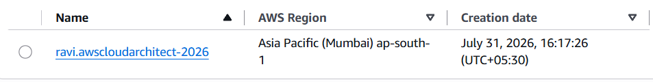
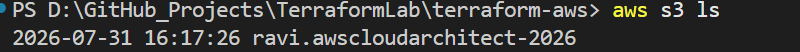
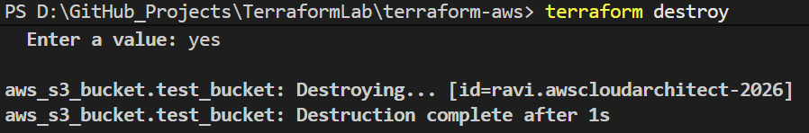

# Creating infra using terraform on AWS cloud
# Provider block for AWS
```
terraform {
  required_providers {
    aws = {
      source  = "hashicorp/aws"
      version = "~> 5.0"
    }
  }
}

provider "aws" {
  region = "us-east-1"
}
```
## creating a s3 bucket
```
# AWS Resource creating a s3 bucket
resource "aws_s3_bucket" "test_bucket" {
    bucket = "ravi.awscloudarchitect-2026" 
    # bucket name must be unique
}
```
## bucket created
<details>
<summary>Check s3 bucket created in console </summary>

  

</details>

<details>
  <summary>Check s3 bucket created in console from Terminal - aws s3 ls </summary>
  
  

</details>

## `terraform destroy `

<details>
  <summary>terraform destroy</summary>
  
  

</details>